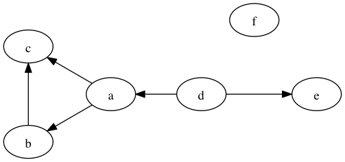
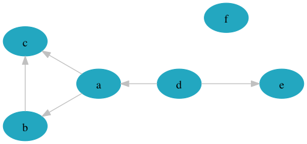
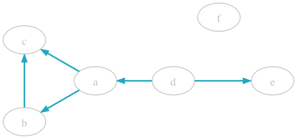
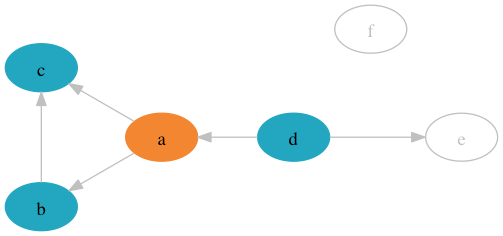
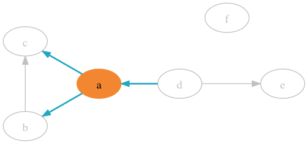
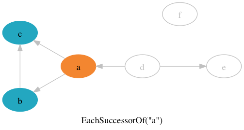
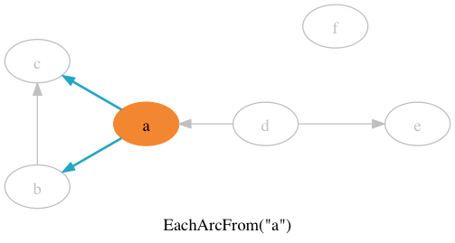
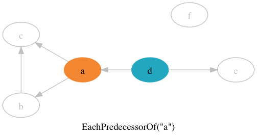
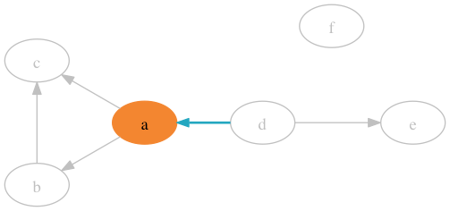

# gogl

[](https://travis-ci.org/sdboyer/gogl)
[](https://coveralls.io/r/sdboyer/gogl?branch=master)

gogl is a graph library in Go. Its goal is to provide simple, unifying interfaces and implementations of graph algorithms and datastructures that can scale from small graphs to very large graphs. The latter case is, as yet, untested!

gogl is based on the premise that working with graphs can be [decomplected](http://www.infoq.com/presentations/Simple-Made-Easy) by focusing primarily on the natural constraints established in graph theory.

There's still a lot to do - gogl is still firming up significant aspects of how its API works.

## Principles

Graph systems are often big, complicated affairs. gogl tries to be not that. These are the operant principles:

1. Simplicity: fully and correctly modeling graph theoretic concepts in idiomatic Go.
1. Performance: be as fast as design constraints and known-best algorithms allow.
1. Extensibility: expect others to run gogl's graph datastructures through their own algorithms, , and gogl's algorithms with their graph implementations.
1. Functional: orient towards transforms, functors, and streams; achieve other styles through layering.
1. Flexibility: Be unopinionated about vertices, and minimally opinionated about edges.
1. Correctness: Utilize [commonly accepted graph terminology](http://en.wikipedia.org/wiki/Glossary_of_graph_theory) where possible, and adhere to its meaning.

The first and last points are key - names in gogl are carefully chosen, with the hope that they can guide intuition when stricter rules (e.g., the type system) become ambiguous. The [godoc](https://godoc.org/github.com/sdboyer/gogl) generally takes care to detail these subtleties. But godoc is a reference, not a tutorial.

## Quickstart

Getting started with gogl is simple: create a graph object, add your data, and off you go.

```go
package main

import (
	"fmt"
	"github.com/sdboyer/gogl"
	"github.com/sdboyer/gogl/dfs"
)

func main() {
	// gogl uses a builder to specify the kind of graph you want.
	graph := gogl.G().
		// The graph should be mutable. Default is immutable.
		Mutable().
		// The graph should have directed edges (arcs). Default is undirected.
		Directed().
		// The graph's edges are plain - no labels, weights, etc. This is the default.
		Basic().
		// No loops or parallel edges. This is the default.
		SimpleGraph().
		// gogl.AdjacencyList picks and returns an adjacency list-based graph, based on the spec.
		Create(gogl.AdjacencyList).
		// The builder always returns a Graph; type assert to get access to add/remove methods.
		(gogl.MutableGraph)

	// Adds two basic edges. Of course, this adds the vertices, too.
	graph.AddEdges(gogl.NewEdge("foo", "bar"), gogl.NewEdge("bar", "baz"))

	// gogl's core iteration concept is built on injected functions (VertexStep or
	// EdgeStep). Here, a VertexStep is called once per vertex in the graph;
	// the return value determines whether traversal continues.
	graph.EachVertex(func(v gogl.Vertex) (terminate bool) {
		fmt.Println(v) // Probably "foo\nbar\nbaz", but ordering is not guaranteed.
		return // returns false, so iteration continues
	})

	// gogl refers to these sorts of iterating methods as enumerators. There are four
	// such methods on undirected graphs, and two more on directed graphs.

	// If you know you need the full result set, gogl provides functors to collect enumerations
	// into slices. This makes ranging easy.
	var vertices []gogl.Vertex = gogl.CollectVertices(graph)
	for _, v := range vertices {
		fmt.Println(v) // same as with EachVertex().
	}

	// The pattern is the same with edge enumeration. These two have the same output:
	graph.EachEdge(func(e gogl.Edge) (terminate bool) {
		fmt.Println(e) // Probably "{foo bar}\n{bar baz}". Again, ordering is not guaranteed.
		return
	})
	for _, e := range gogl.CollectEdges(graph) {
		fmt.Println(e)
	}

	// gogl's algorithms all rely on these enumerators to do their work. Here, we use
	// a depth-first topological sort algorithm to produce a slice of vertices.
	var tsl []gogl.Vertex
	tsl, err := dfs.Toposort(graph, "foo")
	if err == nil {
		fmt.Println(tsl) // [baz bar foo]
	}
}
```

## Enumerators

Enumerators are the primary means by which gogl graphs are expressed. As shown in the Quickstart section, they are methods on graph datastructures that receive a 'step' function, and call that function once per datum (Vertex or Edge) that is found as the method traverses the graph. There are four enumerators for gogl's undirected graphs, and four additional ones for directed graphs.

We need an example in order to demonstrate the behavior of the enumerators, so, here's the code to create a graph:

```go
func main() {
	graph := gogl.G().Mutable().Directed().Create(gogl.AdjacencyList)

	graph.AddEdges([]gogl.Edge{
		NewEdge("a", "b"),
		NewEdge("b", "c"),
		NewEdge("a", "c"),
		NewEdge("a", "c"),
		NewEdge("d", "a"),
		NewEdge("d", "e"),
	})

	// 'f' is a vertex isolate.
	graph.EnsureVertex("f")
}
```

And here's a visual representation of that same graph:



Enumerators mostly come in pairs - for each type of relationship or listing, you can receive either the vertex or the edge.

### All the things

The first two enumerators, `EachVertex()` and `EachEdge()`, traverse the entire graph. Calling `EachVertex()` would result in six calls to the injected step function, one for each of the contained vertices (marked in blue).



Calling `EachEdge()` will call the injected step six times, once for each of the contained edges:



An important guarantee of enumerators not necessarily implied by the interface is that they call the step function *exactly* once for each relevant datum. Client code should never have to deduplicate data.

Also, remember that while implementations must enumerate all the elements exactly once, gogl has no requirement as to ordering. Graph implementations are free to sort the results, or not, as they choose.

### Adjacency and Incidence

The next pair, `EachAdjacentTo()` and `EachEdgeIncidentTo()`, are used to visit a given vertex's immediate neighbors.

`EachAdjacentTo()` traverses a vertex's "adjacent" vertices, which are defined as vertices that share an edge with the given vertex. Edge directionality, if any, is irrelevant. In our sample graph, calling `EachAdjacentTo("a")` will result in three calls to the injected step.



`EachEdgeIncidentTo()` enumerates all edges incident to the provided vertex. An edge is incident to a vertex if that vertex is either one of the edge's two connected endpoints; this is just an edge-oriented way of looking at that same adjacency relationship. Edge directionality, if any, is once again irrelevant.



### Digraphs: Outbounds and Successors

The other four enumerators apply only to directed graphs, as they are cognizant of edge directionality. The first pair, `EachSuccessorOf()` and `EachArcFrom()`, deal with outbound edges from a given vertex.

`EachSuccessorOf()` enumerates all of a given vertex's "successors" - vertices which are the target, or head, of a directed edge where the given vertex is the tail, or source.



`EachArcFrom()` enumerates all the outbound arcs ("arc" simply indicates an edge is directed) from the given vertex:



### Digraphs: Inbounds and Predecessors

The final pair, `EachPredecessor()` and `EachArcTo()`, should be easy enough to guess at. `EachPredecessor()` enumerates all of a vertex's predecessors.



And `EachArcTo()` enumerates all the arcs inbound to the given vertex:



`EachPredecessorOf()` and `EachSuccessorOf()` are the logical complements; calling both is equivalent to calling `EachAdjacentTo()`. The same is true of the arc methods and `EachEdgeIncidentTo()`.

These eight enumerators are gogl's most important building blocks. They fully describe the basic structure of a graph-based model, and can be combined to formulate essentially any basic graph visitation pattern.

There are some additional enumerators for graph subtypes - e.g., `EachLabeledEdgeIncidentTo()` (not yet implemented) is an "optional optimization" enumerator that labeled graphs can implement if, say, they maintain indices that allow them to more efficiently locate and return the subset of incident edges with a particular label than would a naive traversal of the entire incident edge set with direct string comparisons.

Where possible, such optional optimizations are automatically selected and utilized by gogl's various functors.

## License

MIT
